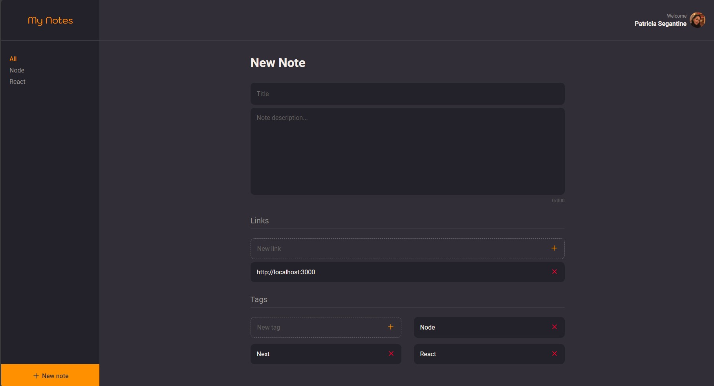

# My notes

---

Welcome to my project! This is a showcase of my work and skills in web development.

[](https://github.com/patriciasegantine/my-notes.git/)

## Introduction

---

### Features

- Create, Read, Update, and Delete notes.
- Seamless integration between the backend API and the frontend UI.

## Technologies Used

---

- React
- React Router Dom
- TypeScript
- Antd Design
- Axios
- Styled Components
- Vite
- React icons
- Vercel

## Setup Instructions

---

To run this project locally, follow the steps below:

1. Make sure you have Node.js and npm installed on your machine.
2. Clone from Github ``git clone https://github.com/patriciasegantine/my-notes.git``
3. Navigate to the project directory.
4. Install the dependencies by running the following command: ```` npm install ````

5. Start the development server with the following command:
   ```` npm start ````

6. This will launch the project in your browser at [http://localhost:4000](http://localhost:4000).

## Build

---

1. To build the project for production, use the following command: ``` npm build ```

2. This will generate an optimized and minified version of your project in the `dist` directory.


## Deploy

---

This application is hosted on a free service, and as a result, it may experience occasional slowness. We appreciate your
understanding and patience.

### Front-end:

[//]: # (todo: add link)

### Back-end:
[//]: # (todo: add link)

## Screenshots

--- 
### Sing in


### Home


### Profile


### New note



### Details


---

Feel free to explore my project, which focuses on daily care and well-being. If you have any questions or would like to
collaborate, please don't hesitate to get in touch!

— Patricia Segantine
